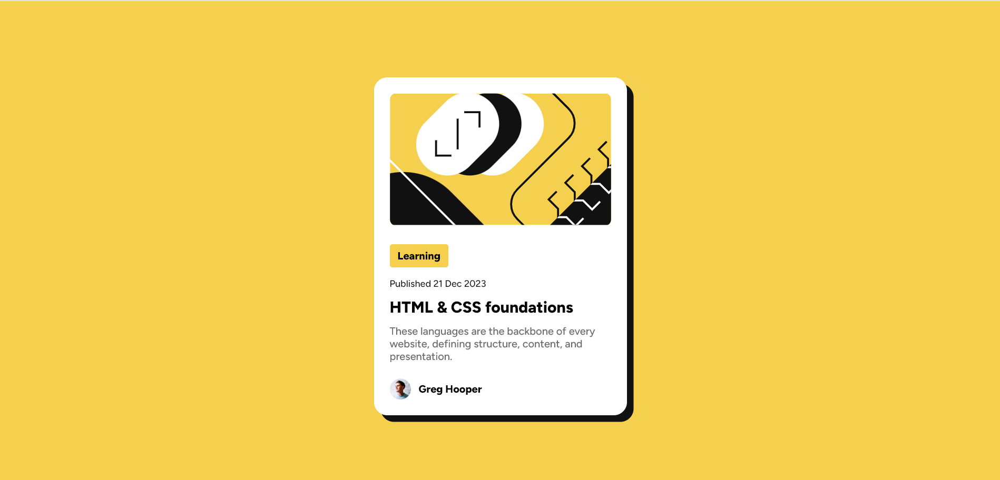

# Blog Preview Card

This project is a responsive blog preview card built with pure HTML and CSS. It is based on a challenge from [Frontend Mentor](https://www.frontendmentor.io) designed to enhance front-end coding skills by replicating realistic projects.

## Table of Contents

- [Overview](#overview)
  - [Features](#features)
  - [Screenshot](#screenshot)
  - [Links](#links)
- [Built With](#built-with)
- [Getting Started](#getting-started)
  - [Installation](#installation)
  - [Usage](#usage)
- [Author](#author)
- [Acknowledgments](#acknowledgments)

## Overview

### Features

- Responsive design adaptable to various screen sizes.
- Hover and focus states for all interactive elements.

### Screenshot



### Links

- [Live Demo](https://chihaadam.github.io/Blog-preview-card/)
- [Frontend Mentor Challenge](https://www.frontendmentor.io/challenges/blog-preview-card-component-2OZUbNrvXM)

## Built With

- Semantic HTML5 markup
- CSS custom properties
- Flexbox

## Getting Started

To get a local copy up and running, follow these simple steps.

### Installation

1. Clone the repository:

   ```bash
   git clone https://github.com/ChihaAdam/Blog-preview-card.git
   ```

2. Navigate to the project directory:

   ```bash
   cd Blog-preview-card
   ```

### Usage

Open `index.html` in your preferred web browser to view the project.

## Author

- GitHub - [ChihaAdam](https://github.com/ChihaAdam)
- Frontend Mentor - [@ChihaAdam](https://www.frontendmentor.io/profile/ChihaAdam)

## Acknowledgments

This project was inspired by a challenge from [Frontend Mentor](https://www.frontendmentor.io), which provides real-world coding challenges to improve front-end skills.
